```
        _
   __ _(_)      _ __ ___   ___ _ __ ___   ___  _ __ _   _
  / _` | |___  | '_ ` _ \ / _ \ '_ ` _ \ / _ \| '__| | | |
 | (_| | |___| | | | | | |  __/ | | | | | (_) | |  | |_| |
  \__,_|_|     |_| |_| |_|\___|_| |_| |_|\___/|_|   \__, |
                universal AI memory                   |___/
```

[](https://github.com/alphaonedev/ai-memory-mcp/actions/workflows/ci.yml)
[](https://www.rust-lang.org/)
[](LICENSE)
[](https://www.sqlite.org/)
[-brightgreen)]()
[]()
[]()

**ai-memory is a persistent memory system for AI assistants.** It works with **any AI that supports MCP** -- Claude, ChatGPT, Grok, Llama, and more. It stores what your AI learns in a local SQLite database, ranks memories by relevance when recalling, and auto-promotes important knowledge to permanent storage. Install it once, and every AI assistant you use remembers your architecture, your preferences, your corrections -- forever.

**Zero token cost until recall.** Unlike built-in memory systems (Claude Code auto-memory, ChatGPT memory) that load your entire memory into every conversation -- burning tokens and money on every message -- ai-memory uses zero context tokens until the AI explicitly calls `memory_recall`. Only relevant memories come back, ranked by a 6-factor scoring algorithm. **TOON format** (Token-Oriented Object Notation) cuts response tokens by another 40-60% by eliminating repeated field names -- 3 memories in JSON = 1,600 bytes; in TOON = 626 bytes (61% smaller); in TOON compact = 336 bytes (79% smaller). For Claude Code users: **disable auto-memory** (`"autoMemoryEnabled": false` in settings.json) and replace it with ai-memory to stop paying for 200+ lines of memory context on every single message.

---

## Compatible AI Platforms

ai-memory integrates with any AI platform that supports the **Model Context Protocol (MCP)**. MCP is the universal standard for connecting AI assistants to external tools and data sources.

| Platform | Integration Method | Config Format | Status |
|----------|-------------------|---------------|--------|
| **Claude Code** (Anthropic) | MCP stdio | JSON (`~/.claude.json` or `.mcp.json`) | Fully supported |
| **Codex CLI** (OpenAI) | MCP stdio | TOML (`~/.codex/config.toml`) | Fully supported |
| **Gemini CLI** (Google) | MCP stdio | JSON (`~/.gemini/settings.json`) | Fully supported |
| **[Grok CLI](https://github.com/alphaonedev/grok-cli)** (xAI) | MCP stdio | JSON (`~/.grok/user-settings.json`) | **Deep integration** |
| **Grok API** (xAI) | MCP remote HTTPS | API-level | Fully supported |
| **Cursor IDE** | MCP stdio | JSON (`~/.cursor/mcp.json`) | Fully supported |
| **Windsurf** (Codeium) | MCP stdio | JSON (`~/.codeium/windsurf/mcp_config.json`) | Fully supported |
| **Continue.dev** | MCP stdio | YAML (`~/.continue/config.yaml`) | Fully supported |
| **Llama Stack** (META) | MCP remote HTTP | YAML / Python SDK | Fully supported |
| **OpenClaw** | MCP stdio | JSON (`mcp.servers` in config) | Fully supported |
| **Any MCP client** | MCP stdio or HTTP | Varies | Universal |

MCP is the primary integration layer. For AI platforms that do not yet support MCP natively, the **HTTP API** (24 endpoints on localhost) and the **CLI** (26 commands) provide universal access -- any AI, script, or automation that can make HTTP calls or run shell commands can use ai-memory.

---

## Install in 60 Seconds

Pre-built binaries require no dependencies. Building from source needs Rust and a C compiler.

**Fastest: Pre-built binary (no Rust required)**

```bash
# macOS / Linux
curl -fsSL https://raw.githubusercontent.com/alphaonedev/ai-memory-mcp/main/install.sh | sh

# Ubuntu (PPA)
sudo add-apt-repository ppa:jbridger2021/ai-memory && sudo apt install ai-memory

# Fedora/RHEL (COPR)
sudo dnf copr enable alpha-one-ai/ai-memory && sudo dnf install ai-memory

# Windows (PowerShell)
irm https://raw.githubusercontent.com/alphaonedev/ai-memory-mcp/main/install.ps1 | iex
```

**Step 1: Install Rust** (skip if using pre-built binaries)

```bash
curl --proto '=https' --tlsv1.2 -sSf https://sh.rustup.rs | sh
```

Follow the prompts, then restart your terminal (or run `source ~/.cargo/env`).

**Step 2: From source (requires Rust)**

Latest release from [Crates.io](https://crates.io/crates/ai-memory):

```bash
cargo install ai-memory
```

Latest from the git repository:

```bash
cargo install --git https://github.com/alphaonedev/ai-memory-mcp.git
```

This compiles the binary and puts it in your PATH. It takes a minute or two.

> **Build dependencies for source builds:**
> - Ubuntu/Debian: `sudo apt-get install build-essential pkg-config`
> - Fedora/RHEL: `sudo dnf install gcc pkg-config`

**Step 3: Connect your AI**

Configuration varies by platform. Find yours below:

<details>
<summary><strong>Claude Code</strong> (Anthropic)</summary>

Claude Code supports three MCP configuration scopes:

| Scope | File | Applies to |
|-------|------|------------|
| **User** (global) | `~/.claude.json` — add `mcpServers` key | All projects on your machine |
| **Project** (shared) | `.mcp.json` in project root (checked into git) | Everyone on the project |
| **Local** (private) | `~/.claude.json` — under `projects."/path".mcpServers` | One project, just you |

**User scope (recommended — works everywhere):**

Add the `mcpServers` key to `~/.claude.json` (macOS/Linux) or `%USERPROFILE%\.claude.json` (Windows):

```json
{
  "mcpServers": {
    "memory": {
      "command": "ai-memory",
      "args": ["--db", "~/.claude/ai-memory.db", "mcp", "--tier", "semantic"]
    }
  }
}
```

> **Note:** `~/.claude.json` likely already exists with other settings. Merge the `mcpServers` key into the existing file — do not overwrite it.

**Project scope (shared with team):**

Create `.mcp.json` in your project root:

```json
{
  "mcpServers": {
    "memory": {
      "command": "ai-memory",
      "args": ["--db", "~/.claude/ai-memory.db", "mcp", "--tier", "semantic"]
    }
  }
}
```

> **Windows paths:** Use forward slashes or escaped backslashes in `--db`. Example: `"--db", "C:/Users/YourName/.claude/ai-memory.db"`.

> **Tier flag:** The `--tier` flag selects the feature tier: `keyword`, `semantic` (default), `smart`, or `autonomous`. Smart and autonomous tiers require [Ollama](https://ollama.com) running locally. The `--tier` flag **must** be passed in the args — the `config.toml` tier setting is not used when the MCP server is launched by an AI client.

> **Important:** MCP servers are **not** configured in `settings.json` or `settings.local.json` — those files do not support `mcpServers`.

**Make Claude proactively use ai-memory:** Add a `CLAUDE.md` file to your project root with ai-memory directives. This ensures Claude recalls context at the start of every conversation and stores findings as it works. See the [CLAUDE.md integration guide](CLAUDE.md#using-claudemd-in-your-projects) for a copy-paste template and placement options.

</details>

<details>
<summary><strong>OpenAI Codex CLI</strong></summary>

Add to `~/.codex/config.toml` (global) or `.codex/config.toml` (project). Windows: `%USERPROFILE%\.codex\config.toml`. Override with `CODEX_HOME` env var.

```toml
[mcp_servers.memory]
command = "ai-memory"
args = ["--db", "~/.local/share/ai-memory/memories.db", "mcp", "--tier", "semantic"]
enabled = true
```

Or add via CLI: `codex mcp add memory -- ai-memory --db ~/.local/share/ai-memory/memories.db mcp --tier semantic`

> **Notes:** Codex uses TOML format with underscored key `mcp_servers` (not camelCase, not hyphenated). Supports `env` (key/value pairs), `env_vars` (list to forward), `enabled_tools`, `disabled_tools`, `startup_timeout_sec`, `tool_timeout_sec`. Use `/mcp` in the TUI to view server status. See [Codex MCP docs](https://developers.openai.com/codex/mcp).

</details>

<details>
<summary><strong>Google Gemini CLI</strong></summary>

Add to `~/.gemini/settings.json` (user) or `.gemini/settings.json` (project). Windows: `%USERPROFILE%\.gemini\settings.json`.

```json
{
  "mcpServers": {
    "memory": {
      "command": "ai-memory",
      "args": ["--db", "~/.local/share/ai-memory/memories.db", "mcp", "--tier", "semantic"],
      "timeout": 30000
    }
  }
}
```

Or add via CLI: `gemini mcp add memory ai-memory -- --db ~/.local/share/ai-memory/memories.db mcp --tier semantic`

> **Notes:** Avoid underscores in server names (use hyphens). Tool names are auto-prefixed as `mcp_memory_<toolName>`. Env vars in the `env` field support `$VAR` / `${VAR}` (all platforms) and `%VAR%` (Windows). Gemini sanitizes sensitive patterns from inherited env unless explicitly declared. Add `"trust": true` to skip confirmation prompts. CLI management: `gemini mcp list/remove/enable/disable`. See [Gemini CLI MCP docs](https://geminicli.com/docs/tools/mcp-server/).

</details>

<details>
<summary><strong>Cursor IDE</strong></summary>

Add to `~/.cursor/mcp.json` (global) or `.cursor/mcp.json` (project). Windows: `%USERPROFILE%\.cursor\mcp.json`. Project config overrides global for same-named servers.

```json
{
  "mcpServers": {
    "memory": {
      "command": "ai-memory",
      "args": ["--db", "~/.local/share/ai-memory/memories.db", "mcp", "--tier", "semantic"]
    }
  }
}
```

> **Notes:** Restart Cursor after editing `mcp.json`. Verify server status in Settings > Tools & MCP (green dot = connected). Supports `env`, `envFile`, and `${env:VAR_NAME}` interpolation (env var interpolation can be unreliable for shell profile variables — use `envFile` as workaround). **~40 tool limit** across all MCP servers. See [Cursor MCP docs](https://cursor.com/docs/context/mcp).

</details>

<details>
<summary><strong>Windsurf</strong> (Codeium)</summary>

Add to `~/.codeium/windsurf/mcp_config.json` (global only — no project-level scope). Windows: `%USERPROFILE%\.codeium\windsurf\mcp_config.json`.

```json
{
  "mcpServers": {
    "memory": {
      "command": "ai-memory",
      "args": ["--db", "~/.local/share/ai-memory/memories.db", "mcp", "--tier", "semantic"]
    }
  }
}
```

> **Notes:** Supports `${env:VAR_NAME}` interpolation in `command`, `args`, `env`, `serverUrl`, `url`, and `headers`. **100 tool limit** across all MCP servers. Can also add via MCP Marketplace or Settings > Cascade > MCP Servers. See [Windsurf MCP docs](https://docs.windsurf.com/windsurf/cascade/mcp).

</details>

<details>
<summary><strong>Continue.dev</strong></summary>

Add to `~/.continue/config.yaml` (user) or `.continue/mcpServers/` directory in project root (per-server YAML/JSON files). Windows: `%USERPROFILE%\.continue\config.yaml`.

```yaml
mcpServers:
  - name: memory
    command: ai-memory
    args:
      - "--db"
      - "~/.local/share/ai-memory/memories.db"
      - "mcp"
      - "--tier"
      - "semantic"
```

> **Notes:** MCP tools only work in agent mode. Supports `${{ secrets.SECRET_NAME }}` for secret interpolation. Project-level `.continue/mcpServers/` directory auto-detects JSON configs from other tools (Claude Code, Cursor, etc.). See [Continue MCP docs](https://docs.continue.dev/customize/deep-dives/mcp).

</details>

<details>
<summary><strong>Grok CLI</strong> (AlphaOne fork — deep integration with auto-recall)</summary>

The [AlphaOne fork of grok-cli](https://github.com/alphaonedev/grok-cli) has built-in ai-memory support with session-scoped MCP connections, automatic memory recall on session start, compaction summary storage, and memory-aware system prompts.

Add to `~/.grok/user-settings.json`:

```json
{
  "mcp": {
    "servers": [
      {
        "id": "ai-memory",
        "label": "AI Memory",
        "enabled": true,
        "transport": "stdio",
        "command": "ai-memory",
        "args": ["mcp", "--tier", "semantic"]
      }
    ]
  }
}
```

> **Features:** Auto-recall on session start (injects relevant memories into system prompt), compaction summaries stored as mid-tier memories, MCP tools available in all modes (agent, plan, ask), session-scoped connections (no per-message cold starts). Uses `--tier semantic` by default (local embeddings, no Ollama required). See [grok-cli docs](https://github.com/alphaonedev/grok-cli/blob/main/docs/CONFIGURATION.md) for full setup.

</details>

<details>
<summary><strong>xAI Grok API</strong> (API-level, remote MCP)</summary>

Grok connects to MCP servers over HTTPS (remote only, no stdio). No config file — servers are specified per API request.

```bash
ai-memory serve --host 127.0.0.1 --port 9077
# Expose via HTTPS reverse proxy (nginx, caddy, cloudflare tunnel, etc.)
```

Then add the MCP server to your Grok API call:

```bash
curl https://api.x.ai/v1/responses \
  -H "Authorization: Bearer $XAI_API_KEY" \
  -H "Content-Type: application/json" \
  -d '{
    "model": "grok-3",
    "tools": [{
      "type": "mcp",
      "server_url": "https://your-server.example.com/mcp",
      "server_label": "memory",
      "server_description": "Persistent AI memory with recall and search",
      "allowed_tools": ["memory_store", "memory_recall", "memory_search"]
    }],
    "input": "What do you remember about our project?"
  }'
```

> **Requirements:** HTTPS required. `server_label` is required. Supports Streamable HTTP and SSE transports. Optional: `allowed_tools`, `authorization`, `headers`. Works with xAI SDK, OpenAI-compatible Responses API, and Voice Agent API. See [xAI Remote MCP docs](https://docs.x.ai/docs/guides/tools/remote-mcp-tools).

</details>

<details>
<summary><strong>META Llama</strong> (via Llama Stack)</summary>

Llama Stack registers MCP servers as toolgroups. No standardized config file path — deployment-specific.

```bash
ai-memory serve --host 127.0.0.1 --port 9077
```

**Python SDK:**

```python
client.toolgroups.register(
    provider_id="model-context-protocol",
    toolgroup_id="mcp::memory",
    mcp_endpoint={"uri": "http://localhost:9077/sse"}
)
```

**Or declaratively in run.yaml:**

```yaml
tool_groups:
  - toolgroup_id: mcp::memory
    provider_id: model-context-protocol
    mcp_endpoint:
      uri: "http://localhost:9077/sse"
```

> **Notes:** Supports `${env.VAR_NAME}` interpolation in run.yaml. Transport is migrating from SSE to Streamable HTTP. See [Llama Stack Tools docs](https://llama-stack.readthedocs.io/en/latest/building_applications/tools.html).

</details>

<details>
<summary><strong>OpenClaw</strong></summary>

Add via CLI or edit the OpenClaw config directly. Config uses `mcp.servers` (not `mcpServers`).

```bash
openclaw mcp set memory '{"command":"ai-memory","args":["--db","~/.local/share/ai-memory/memories.db","mcp","--tier","semantic"]}'
```

Or add to your OpenClaw config file:

```json
{
  "mcp": {
    "servers": {
      "memory": {
        "command": "ai-memory",
        "args": ["--db", "~/.local/share/ai-memory/memories.db", "mcp", "--tier", "semantic"]
      }
    }
  }
}
```

> **Notes:** OpenClaw uses `mcp.servers` key (not `mcpServers`). CLI management: `openclaw mcp list`, `openclaw mcp show`, `openclaw mcp set`, `openclaw mcp unset`. Supports stdio, remote URL, and Streamable HTTP transports. Prefer `--token-file` over inline secrets. See [OpenClaw MCP docs](https://docs.openclaw.ai/cli/mcp).

</details>

<details>
<summary><strong>Any other MCP client</strong></summary>

ai-memory speaks MCP over stdio (JSON-RPC 2.0). Point your client at:

```
command: ai-memory
args: ["--db", "/path/to/ai-memory.db", "mcp"]
```

For HTTP-only clients, start the REST API:

```bash
ai-memory serve
# 24 endpoints at http://127.0.0.1:9077/api/v1/
```

</details>

**Step 4: Done. Test it.**

Restart your AI assistant. If using MCP, it now has 21 memory tools. Ask it: "Store a memory that my favorite language is Rust." Then in a new conversation, ask: "What is my favorite language?" It will remember.

---

## Quickstart

Get from zero to a working memory in under two minutes.

**1. Install**

```bash
curl -fsSL https://raw.githubusercontent.com/alphaonedev/ai-memory-mcp/main/install.sh | sh
```

**2. Configure MCP** (example for Claude Code -- other platforms work the same way)

Merge into `~/.claude.json`:

```json
{
  "mcpServers": {
    "memory": {
      "command": "ai-memory",
      "args": ["--db", "~/.claude/ai-memory.db", "mcp", "--tier", "semantic"]
    }
  }
}
```

**3. Store your first memory**

```bash
ai-memory store -T "Project uses PostgreSQL 15" -c "Main DB is PG 15 with pgvector." --tier long
```

**4. Recall it**

```bash
ai-memory recall "database"
```

**5. Check stats**

```bash
ai-memory stats
```

**6. Use with your AI.** Restart your AI client. It now has **21 memory tools** available via MCP -- it can store and recall memories natively during conversations.

---

## What Does It Do?

AI assistants forget everything between conversations. ai-memory fixes that.

It runs as an MCP (Model Context Protocol) tool server -- a background process that your AI talks to natively. When your AI learns something important, it stores it. When it needs context, it recalls relevant memories ranked by a 6-factor scoring algorithm. Memories live in three tiers:

- **Short-term** (6 hours default, configurable) -- throwaway context like current debugging state
- **Mid-term** (7 days default, configurable) -- working knowledge like sprint goals and recent decisions
- **Long-term** (permanent) -- architecture, user preferences, hard-won lessons

Memories that keep getting accessed automatically promote from mid to long-term. Each recall extends the TTL. Priority increases with usage. The system is self-curating.

Beyond MCP, ai-memory also exposes a full HTTP REST API (24 endpoints on port 9077) and a complete CLI (26 commands) for direct interaction, scripting, and integration with any AI platform or tool.

---

## Features

### Core
- **MCP tool server** -- 23 tools over stdio JSON-RPC, compatible with any MCP client
- **Three-tier memory** -- short (6h TTL default), mid (7d TTL default), long (permanent) -- TTLs are configurable
- **Full-text search** -- SQLite FTS5 with ranked retrieval
- **Hybrid recall** -- FTS5 keyword + cosine similarity with fixed 0.6 semantic / 0.4 keyword (60/40) blend weights
- **6-factor recall scoring** -- FTS relevance + priority + access frequency + confidence + tier boost + recency decay
- **Auto-promotion** -- memories accessed 5+ times promote from mid to long
- **TTL extension** -- each recall extends expiry (short +1h, mid +1d)
- **Priority reinforcement** -- +1 every 10 accesses (max 10)
- **Contradiction detection** -- warns when storing memories that conflict with existing ones
- **Deduplication** -- upsert on title+namespace, tier never downgrades
- **Confidence scoring** -- 0.0-1.0 certainty factored into ranking

### Organization
- **Namespaces** -- isolate memories per project (auto-detected from git remote)
- **Memory linking** -- typed relations: related_to, supersedes, contradicts, derived_from
- **Consolidation** -- merge multiple memories into a single long-term summary
- **Auto-consolidation** -- group by namespace+tag, auto-merge groups above threshold
- **Contradiction resolution** -- mark one memory as superseding another, demote the loser
- **Forget by pattern** -- bulk delete by namespace + FTS pattern + tier
- **Source tracking** -- tracks origin: user, claude, hook, api, cli, import, consolidation, system
- **Tagging** -- comma-separated tags with filter support

### Interfaces
- **24 HTTP endpoints** -- full REST API on 127.0.0.1:9077 (works with any AI or tool)
- **26 CLI commands** -- complete CLI with identical capabilities
- **25 MCP tools** -- native integration for any MCP-compatible AI
- **Interactive REPL shell** -- recall, search, list, get, stats, namespaces, delete with color output
- **JSON output** -- `--json` flag on all CLI commands

### Operations
- **Multi-node sync** -- pull, push, or bidirectional merge between database files
- **Import/Export** -- full JSON roundtrip preserving memory links
- **Garbage collection** -- automatic background expiry every 30 minutes
- **Graceful shutdown** -- SIGTERM/SIGINT checkpoints WAL for clean exit
- **Deep health check** -- verifies DB accessibility and FTS5 integrity
- **Shell completions** -- bash, zsh, fish
- **Man page** -- `ai-memory man` generates roff to stdout
- **Time filters** -- `--since`/`--until` on list and search
- **Human-readable ages** -- "2h ago", "3d ago" in CLI output
- **Color CLI output** -- ANSI tier labels (red/yellow/green), priority bars, bold titles, cyan namespaces

### Quality
- **190 tests** -- 140 unit tests across all 15 modules + 50 integration tests. **15/15 modules** have unit tests — 95%+ coverage.
- **LongMemEval benchmark** -- **97.8% R@5** (489/500), **99.0% R@10**, **99.8% R@20** on ICLR 2025 LongMemEval-S dataset. 499/500 at R@20. Pure FTS5 keyword achieves 97.0% R@5 in 2.2 seconds (232 q/s). LLM query expansion pushes to 97.8% R@5. Zero cloud API costs. See [benchmark details](benchmarks/longmemeval/).
- **MCP Prompts** -- `recall-first` and `memory-workflow` prompts teach AI clients to use memory proactively
- **TOON-default** -- recall/list/search responses use TOON compact by default (79% smaller than JSON)
- **Criterion benchmarks** -- insert, recall, search at 1K scale
- **GitHub Actions CI/CD** -- fmt, clippy, test, build on Ubuntu + macOS, release on tag

### ML and LLM Dependencies (semantic tier+)
- **candle-core, candle-nn, candle-transformers** -- Hugging Face Candle ML framework for native Rust inference
- **hf-hub** -- download models from Hugging Face Hub
- **tokenizers** -- Hugging Face tokenizers for text preprocessing
- **instant-distance** -- approximate nearest neighbor search
- **reqwest** -- HTTP client for Ollama API communication (smart/autonomous tiers)

---

## Architecture

<p align="center">
  
</p>

---

## Benchmark

<p align="center">
  
</p>

Evaluated on the [ICLR 2025 LongMemEval-S](benchmarks/longmemeval/) dataset (500 questions, 6 categories). Pure FTS5 keyword tier achieves 97.0% R@5 in 2.2 seconds. LLM query expansion (smart tier) pushes to 97.8% R@5. All inference runs locally — zero cloud API calls, zero cost.

| Tier | R@5 | Speed | Dependencies |
|------|-----|-------|-------------|
| **keyword** | 97.0% | 232 q/s | None |
| **semantic** | 97.4% | 45 q/s | Embedding model (~100MB) |
| **smart** | 97.8% | 12 q/s | Ollama + Gemma 4 E2B |

---

## Integration Methods

### MCP (Primary -- for MCP-compatible AI platforms)

MCP is the recommended integration. Your AI gets 21 native memory tools with zero glue code. Configure the MCP server in your AI platform's config:

```json
{
  "mcpServers": {
    "memory": {
      "command": "ai-memory",
      "args": ["--db", "~/.claude/ai-memory.db", "mcp"]
    }
  }
}
```

### HTTP API (Universal -- for any AI or tool)

Start the HTTP server for REST API access. Any AI, script, or automation that can make HTTP calls can use this:

```bash
ai-memory serve
# 24 endpoints at http://127.0.0.1:9077/api/v1/
```

### CLI (Universal -- for scripting and direct use)

The CLI works standalone or as a building block for AI integrations that run shell commands:

```bash
ai-memory store --tier long --title "Architecture decision" --content "We use PostgreSQL"
ai-memory recall "database choice"
ai-memory search "PostgreSQL"
```

---

## Feature Tiers

ai-memory supports 4 feature tiers, selected at startup with `ai-memory mcp --tier <tier>`. Higher tiers add ML capabilities at the cost of disk and RAM:

| Tier | Recall Method | Extra Capabilities | Approx. Overhead |
|------|---------------|-------------------|-----------------|
| **keyword** | FTS5 only | Baseline 23 tools | 0 MB |
| **semantic** | FTS5 + cosine similarity (hybrid) | MiniLM-L6-v2 embeddings (384-dim), HNSW index, 23 tools | ~256 MB |
| **smart** | Hybrid + LLM query expansion | + nomic-embed-text (768-dim) + Gemma 4 E2B via Ollama: `memory_expand_query`, `memory_auto_tag`, `memory_detect_contradiction`, 23 tools | ~1 GB |
| **autonomous** | Hybrid + LLM expansion + cross-encoder reranking | + Gemma 4 E4B via Ollama, neural cross-encoder (ms-marco-MiniLM), memory reflection, 23 tools | ~4 GB |

### Capability Matrix

Every capability mapped to its minimum tier. Each tier includes all capabilities from the tiers below it.

| Capability | keyword | semantic | smart | autonomous |
|-----------|---------|----------|-------|------------|
| **Search & Recall** | | | | |
| FTS5 keyword search | Yes | Yes | Yes | Yes |
| Semantic embedding (cosine similarity) | -- | Yes | Yes | Yes |
| Hybrid recall (FTS5 + cosine, 60/40 semantic/keyword blend) | -- | Yes | Yes | Yes |
| HNSW nearest-neighbor index | -- | Yes | Yes | Yes |
| LLM query expansion (`memory_expand_query`) | -- | -- | Yes | Yes |
| Neural cross-encoder reranking | -- | -- | -- | Yes |
| **Memory Management** | | | | |
| Store, update, delete, promote, link | Yes | Yes | Yes | Yes |
| Manual consolidation | Yes | Yes | Yes | Yes |
| Auto-consolidation (LLM summary) | -- | -- | Yes | Yes |
| Auto-tagging (`memory_auto_tag`) | -- | -- | Yes | Yes |
| Contradiction detection (`memory_detect_contradiction`) | -- | -- | Yes | Yes |
| Autonomous memory reflection | -- | -- | -- | Yes |
| **Models** | | | | |
| Embedding model | -- | MiniLM-L6-v2 (384d) | nomic-embed-text (768d) | nomic-embed-text (768d) |
| LLM | -- | -- | gemma4:e2b (~7.2GB) | gemma4:e4b (~9.6GB) |
| **Resources** | | | | |
| RAM | 0 MB | ~256 MB | ~1 GB | ~4 GB |
| External dependencies | None | None | Ollama | Ollama |
| MCP tools exposed | 21 | 21 | 21 | 21 |

**Semantic tier** (default) bundles the Candle ML framework and downloads the all-MiniLM-L6-v2 model on first run (~90 MB). **Smart** and **autonomous** tiers require [Ollama](https://ollama.com) running locally.

**Tiers gate features, not models.** The `--tier` flag controls which tools are exposed. The LLM model is independently configurable via `llm_model` in `~/.config/ai-memory/config.toml`. For example, run autonomous tier (all 23 tools + reranker) with the faster e2b model:

```toml
# ~/.config/ai-memory/config.toml
tier = "autonomous"        # all features enabled
llm_model = "gemma4:e2b"   # faster model (46 tok/s vs 26 tok/s for e4b)
```

The `--tier` flag **must** be passed in the MCP args -- the `config.toml` tier setting is not used when the server is launched by an AI client.

```bash
# Keyword (default)
ai-memory mcp

# Semantic -- hybrid recall with embeddings
ai-memory mcp --tier semantic

# Smart -- adds LLM-powered query expansion, auto-tagging, contradiction detection
ai-memory mcp --tier smart

# Autonomous -- adds cross-encoder reranking
ai-memory mcp --tier autonomous
```

The `memory_capabilities` tool reports the active tier, loaded models, and available capabilities at runtime.

---

## MCP Tools

These 23 tools are available to any MCP-compatible AI when configured as an MCP server:

| Tool | Description |
|------|-------------|
| `memory_store` | Store a new memory (deduplicates by title+namespace, reports contradictions) |
| `memory_recall` | Recall memories relevant to a context (fuzzy OR search, ranked by 6 factors) |
| `memory_search` | Search memories by exact keyword match (AND semantics) |
| `memory_list` | List memories with optional filters (namespace, tier, tags, date range) |
| `memory_get` | Get a specific memory by ID with its links |
| `memory_update` | Update an existing memory by ID (partial update) |
| `memory_delete` | Delete a memory by ID |
| `memory_promote` | Promote a memory to long-term (permanent, clears expiry) |
| `memory_forget` | Bulk delete by pattern, namespace, or tier |
| `memory_link` | Create a typed link between two memories |
| `memory_get_links` | Get all links for a memory |
| `memory_consolidate` | Merge multiple memories into one long-term summary |
| `memory_stats` | Get memory store statistics |
| `memory_capabilities` | Report active feature tier, loaded models, and available capabilities |
| `memory_expand_query` | Use LLM to expand search query into related terms (smart+ tier) |
| `memory_auto_tag` | Use LLM to auto-generate tags for a memory (smart+ tier) |
| `memory_detect_contradiction` | Use LLM to check if two memories contradict (smart+ tier) |
| `memory_archive_list` | List archived memories (with optional namespace/tier/tag filters) |
| `memory_archive_restore` | Restore an archived memory back to the active store |
| `memory_archive_purge` | Permanently delete archived memories matching filters |
| `memory_archive_stats` | Get archive statistics (counts by tier, namespace, age) |

---

## HTTP API

24 endpoints on `127.0.0.1:9077`. Start with `ai-memory serve`.

> **Security:** The HTTP server binds to 127.0.0.1 with no authentication and permissive CORS. Do not expose to the network without a reverse proxy with authentication.

| Method | Endpoint | Description |
|--------|----------|-------------|
| GET | `/api/v1/health` | Health check (verifies DB + FTS5 integrity) |
| GET | `/api/v1/memories` | List memories (supports namespace, tier, tags, since, until, limit) |
| POST | `/api/v1/memories` | Create a memory |
| POST | `/api/v1/memories/bulk` | Bulk create memories (with limits) |
| GET | `/api/v1/memories/{id}` | Get a memory by ID |
| PUT | `/api/v1/memories/{id}` | Update a memory by ID |
| DELETE | `/api/v1/memories/{id}` | Delete a memory by ID |
| POST | `/api/v1/memories/{id}/promote` | Promote a memory to long-term |
| GET | `/api/v1/search` | AND keyword search |
| GET | `/api/v1/recall` | Recall by context (GET with query params) |
| POST | `/api/v1/recall` | Recall by context (POST with JSON body) |
| POST | `/api/v1/forget` | Bulk delete by pattern/namespace/tier |
| POST | `/api/v1/consolidate` | Consolidate memories into one |
| POST | `/api/v1/links` | Create a link between memories |
| GET | `/api/v1/links/{id}` | Get links for a memory |
| GET | `/api/v1/namespaces` | List all namespaces |
| GET | `/api/v1/stats` | Memory store statistics |
| POST | `/api/v1/gc` | Trigger garbage collection |
| GET | `/api/v1/export` | Export all memories + links as JSON |
| POST | `/api/v1/import` | Import memories + links from JSON |
| GET | `/api/v1/archive` | List archived memories (with optional filters) |
| POST | `/api/v1/archive/{id}/restore` | Restore an archived memory to the active store |
| DELETE | `/api/v1/archive` | Purge archived memories matching filters |
| GET | `/api/v1/archive/stats` | Archive statistics (counts by tier, namespace, age) |

---

## CLI Commands

26 commands. Run `ai-memory <command> --help` for details on any command.

| Command | Description |
|---------|-------------|
| `mcp` | Run as MCP tool server over stdio (primary integration path) |
| `serve` | Start the HTTP daemon on port 9077 |
| `store` | Store a new memory (deduplicates by title+namespace) |
| `update` | Update an existing memory by ID |
| `recall` | Fuzzy OR search with ranked results + auto-touch (supports `--tier` for hybrid recall). Max 200 items per request. |
| `search` | AND search for precise keyword matches. Max 200 items per request. |
| `get` | Retrieve a single memory by ID (includes links) |
| `list` | Browse memories with filters (namespace, tier, tags, date range). Max 200 items per request. |
| `delete` | Delete a memory by ID |
| `promote` | Promote a memory to long-term (clears expiry) |
| `forget` | Bulk delete by pattern + namespace + tier |
| `link` | Link two memories (related_to, supersedes, contradicts, derived_from) |
| `consolidate` | Merge multiple memories into one long-term summary |
| `resolve` | Resolve a contradiction: mark winner, demote loser |
| `shell` | Interactive REPL with color output |
| `sync` | Sync memories between two database files (pull/push/merge) |
| `auto-consolidate` | Group memories by namespace+tag, merge groups above threshold |
| `gc` | Run garbage collection on expired memories |
| `stats` | Overview of memory state (counts, tiers, namespaces, links, DB size) |
| `namespaces` | List all namespaces with memory counts |
| `export` | Export all memories and links as JSON |
| `import` | Import memories and links from JSON (stdin) |
| `completions` | Generate shell completions (bash, zsh, fish) |
| `man` | Generate roff man page to stdout |
| `mine` | Import memories from historical conversations (Claude, ChatGPT, Slack exports) |
| `archive` | Manage the memory archive (list, restore, purge, stats) |

The top-level `ai-memory` binary also accepts global flags:

| Flag | Description |
|------|-------------|
| `--db <path>` | Database path (default: `ai-memory.db`, or `$AI_MEMORY_DB`) |
| `--json` | JSON output on all commands (machine-parseable output) |

The `store` subcommand accepts additional flags:

| Flag | Description |
|------|-------------|
| `--source` / `-S` | Who created this memory (user, claude, hook, api, cli, import, consolidation, system). Default: `cli` |
| `--expires-at` | RFC3339 expiry timestamp |
| `--ttl-secs` | TTL in seconds (alternative to `--expires-at`) |

The `mcp` subcommand accepts an additional flag:

| Flag | Description |
|------|-------------|
| `--tier <keyword\|semantic\|smart\|autonomous>` | Feature tier (default: `semantic`). See [Feature Tiers](#feature-tiers). |

---

## Recall Scoring

Every recall query ranks memories by 6 factors:

```
score = (fts_relevance * -1)
      + (priority * 0.5)
      + (MIN(access_count, 50) * 0.1)
      + (confidence * 2.0)
      + tier_boost
      + recency_decay
```

| Factor | Weight | Notes |
|--------|--------|-------|
| FTS relevance | -1.0x | SQLite FTS5 rank (negative = better match) |
| Priority | 0.5x | User-assigned 1-10 scale |
| Access count | 0.1x | How often recalled (capped at 50 for scoring) |
| Confidence | 2.0x | 0.0-1.0 certainty score |
| Tier boost | +3.0 / +1.0 / +0.0 | long / mid / short |
| Recency decay | `1/(1 + days*0.1)` | Recent memories rank higher |

---

## Memory Tiers

| Tier | TTL | Use Case | Examples |
|------|-----|----------|----------|
| `short` | 6 hours (configurable) | Throwaway context | Current debugging state, temp variables, error traces |
| `mid` | 7 days (configurable) | Working knowledge | Sprint goals, recent decisions, current branch purpose |
| `long` | Permanent | Hard-won knowledge | Architecture, user preferences, corrections, conventions |

### Automatic Behaviors

- **TTL extension on recall**: short memories get +1 hour, mid memories get +1 day
- **Auto-promotion**: mid-tier memories accessed 5+ times promote to long (expiry cleared)
- **Priority reinforcement**: every 10 accesses, priority increases by 1 (capped at 10)
- **Contradiction detection**: warns when a new memory conflicts with an existing one in the same namespace
- **Deduplication**: upsert on title+namespace; tier never downgrades on update

---

## Configurable TTL

Default TTLs (6 hours for short, 7 days for mid) can be overridden in `~/.config/ai-memory/config.toml` under the `[ttl]` section:

```toml
[ttl]
short_ttl_secs = 21600      # short-tier TTL in seconds (default: 21600 = 6 hours)
mid_ttl_secs = 604800        # mid-tier TTL in seconds (default: 604800 = 7 days)
long_ttl_secs = 0            # long-tier TTL in seconds (default: 0 = never expires)
short_extend_secs = 3600     # TTL extension on recall for short-tier memories in seconds (default: 3600 = +1h)
mid_extend_secs = 86400      # TTL extension on recall for mid-tier memories in seconds (default: 86400 = +1d)
```

All five fields are optional -- omit any to keep the default. Set any value to 0 to disable expiry for that tier. Values are clamped to a 10-year maximum; negative extension values are clamped to 0.

> **Note:** Configuration is loaded once at process startup. Changes to `config.toml` require restarting the ai-memory process (MCP server, HTTP daemon, or CLI) to take effect.

---

## Archive

When garbage collection expires a memory, it can be **archived** instead of permanently deleted. Archived memories are moved to a separate store and can be browsed, restored, or purged later.

### Configuration

Enable archiving in `~/.config/ai-memory/config.toml`:

```toml
archive_on_gc = true   # archive expired memories instead of deleting them (default: true)
```

### CLI Commands

The `archive` subcommand manages the archive:

```bash
ai-memory archive list                          # list archived memories
ai-memory archive list --namespace my-project   # filter by namespace
ai-memory archive restore <id>                  # restore an archived memory to active store
ai-memory archive purge --older-than-days 90     # permanently delete archives older than 90 days
ai-memory archive stats                         # show archive statistics
```

> **Note:** Restored memories get their `expires_at` cleared (become permanent until the next TTL assignment).

### MCP Tools

Four archive tools are available to MCP clients:

| Tool | Description |
|------|-------------|
| `memory_archive_list` | List archived memories (with optional namespace/tier/tag filters) |
| `memory_archive_restore` | Restore an archived memory back to the active store |
| `memory_archive_purge` | Permanently delete archived memories matching filters |
| `memory_archive_stats` | Get archive statistics (counts by tier, namespace, age) |

### HTTP Endpoints

| Method | Endpoint | Description |
|--------|----------|-------------|
| GET | `/api/v1/archive` | List archived memories (with optional filters) |
| POST | `/api/v1/archive/{id}/restore` | Restore an archived memory to the active store |
| DELETE | `/api/v1/archive` | Purge archived memories matching filters |
| GET | `/api/v1/archive/stats` | Archive statistics (counts by tier, namespace, age) |

---

## Security

ai-memory includes hardening across all input paths:

- **Transaction safety** -- all multi-step database operations use transactions; no partial writes on failure
- **FTS injection prevention** -- user input is sanitized before reaching FTS5 queries; special characters are escaped
- **Error sanitization** -- internal database paths and system details are stripped from error responses; clients see structured error types (NOT_FOUND, VALIDATION_FAILED, DATABASE_ERROR, CONFLICT)
- **Body size limits** -- HTTP request bodies are capped at 50 MB via Axum's DefaultBodyLimit
- **Bulk operation limits** -- bulk create endpoints enforce maximum batch sizes to prevent resource exhaustion
- **CORS** -- permissive CORS layer enabled for localhost development workflows
- **Input validation** -- every write path validates title length, content length, namespace format, source values, priority range (1-10), confidence range (0.0-1.0), tag format, tier values, relation types, and ID format
- **Link validation in sync** -- all links are validated (both IDs, relation type, no self-links) before import during sync operations
- **Thread-safe color** -- terminal color detection uses `AtomicBool` for safe concurrent access
- **Local-only HTTP** -- the HTTP server binds to 127.0.0.1 by default; not exposed to the network
- **WAL mode** -- SQLite Write-Ahead Logging for safe concurrent reads during writes

---

## Documentation

| Guide | Audience |
|-------|----------|
| [Installation Guide](docs/INSTALL.md) | Getting it running (includes MCP setup for multiple AI platforms) |
| [User Guide](docs/USER_GUIDE.md) | AI assistant users who want persistent memory |
| [Developer Guide](docs/DEVELOPER_GUIDE.md) | Building on or contributing to ai-memory |
| [Admin Guide](docs/ADMIN_GUIDE.md) | Deploying, monitoring, and troubleshooting |
| [GitHub Pages](https://alphaonedev.github.io/ai-memory-mcp/) | Visual overview with animated diagrams |

---

## License

Copyright (c) 2026 **AlphaOne LLC**. All rights reserved.

Licensed under the [MIT License](LICENSE).

THIS SOFTWARE IS PROVIDED "AS IS", WITHOUT WARRANTY OF ANY KIND, EXPRESS OR IMPLIED, INCLUDING BUT NOT LIMITED TO THE WARRANTIES OF MERCHANTABILITY, FITNESS FOR A PARTICULAR PURPOSE AND NONINFRINGEMENT. IN NO EVENT SHALL THE AUTHORS OR COPYRIGHT HOLDERS BE LIABLE FOR ANY CLAIM, DAMAGES OR OTHER LIABILITY, WHETHER IN AN ACTION OF CONTRACT, TORT OR OTHERWISE, ARISING FROM, OUT OF OR IN CONNECTION WITH THE SOFTWARE OR THE USE OR OTHER DEALINGS IN THE SOFTWARE.
